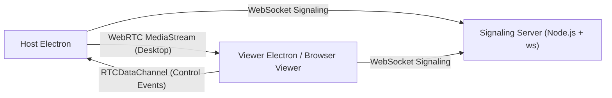

# Remote Desktop WebRTC

A remote desktop control system built with Electron + WebRTC.

This repository contains a production-oriented baseline for:
- low-latency screen streaming (`WebRTC MediaStream`)
- bidirectional control signaling (`RTCDataChannel`)
- lightweight room-based signaling (`Node.js + ws`)

## Overview

The system is split into two runtime components:

- `client` (Electron):
  - Host mode: captures desktop and receives control events
  - Viewer mode: renders remote stream and sends control events
- `server` (Node.js):
  - WebSocket signaling only
  - room lifecycle management (`host` + `viewer`)
  - no media relay, no video frame forwarding

## Key Capabilities

- WebRTC `offer/answer/ice-candidate` negotiation
- Room isolation with strict two-peer limit
- Control channel over `RTCDataChannel` (`mousemove`, `mousedown`, `mouseup`, `click`, `keydown`, `keyup`)
- Host-side execution guard (`Allow Remote Control`)
- Viewer-side safety guard (`Enable Remote Control` + `ESC` emergency stop)
- Native input execution via `@nut-tree/nut-js` with automatic mock fallback
- Signaling server health endpoint (`/healthz`)
- Heartbeat + idle connection eviction on signaling layer

## High-Level Architecture



Core design principles:
- media/data plane separated from signaling plane
- server remains stateless for media transport
- explicit host-side permission gate before native control execution

## Repository Structure

```text
remote-desktop-webrtc/
  client/   # Electron + React + Vite
  server/   # Node.js + ws signaling service
  docs/     # architecture, operations, delivery notes
```

## Configuration

### Server environment variables

| Variable | Default | Description |
|---|---:|---|
| `PORT` | `8080` | HTTP + WebSocket listener port |
| `HEARTBEAT_INTERVAL_MS` | `15000` | WebSocket ping interval |
| `IDLE_TIMEOUT_MS` | `45000` | Idle socket eviction threshold |

Reference: [`server/.env.example`](./server/.env.example)

### Client environment variables

| Variable | Default | Description |
|---|---:|---|
| `VITE_SIGNALING_URL` | `ws://localhost:8080` | Default signaling URL shown in UI |
| `VITE_DEFAULT_ROOM_ID` | `demo-room` | Default room ID shown in UI |

Reference: [`client/.env.example`](./client/.env.example)

## Local Development

From repository root:

```bash
pnpm install
pnpm dev:server
pnpm dev:client
```

Additional commands:

```bash
pnpm typecheck
pnpm build
```

## Validation Flows

### Single-machine functional test

1. Start signaling server.
2. Start first client as Host.
3. Start second client instance as Viewer.
4. Join same room ID.
5. Host starts screen share.
6. Viewer confirms remote video.
7. Viewer enables control sending.
8. Host verifies control logs and (optionally) native execution.

### Two-machine control test (recommended)

1. Machine A runs Host + signaling.
2. Machine B runs Viewer (Electron or browser).
3. Both point to `ws://<MachineA-IP>:8080`.
4. Use same room ID.
5. Validate stream + control behavior.

## Health & Observability

- Health endpoint:
  - `GET /healthz`
  - returns process uptime and room/peer counters
- Server logs:
  - JSON structured logs for connect/join/pair/disconnect/error/shutdown
- Connection hygiene:
  - periodic ping/pong heartbeat
  - stale socket termination after idle timeout

## Security & Permission Model

- Signaling server does not relay media frames.
- Native system control is gated by host UI switch.
- Viewer must explicitly enable control before events are sent.
- On macOS, native control requires Accessibility permission.
- If native automation fails to initialize, system falls back to mock mode without crashing.

## Production Deployment Notes

- Add TURN for restrictive NAT / enterprise networks.
- Add token-based room authorization and session expiry.
- Add audit logs for control actions.
- Add reconnect/backoff strategy and peer session recovery.
- Add transport security hardening (`wss`, reverse proxy, TLS termination).

## Documentation Index

- [Architecture](./docs/ARCHITECTURE.md)
- [Operations Runbook](./docs/OPERATIONS.md)
- [Delivery Checklist](./docs/DELIVERY_CHECKLIST.md)
