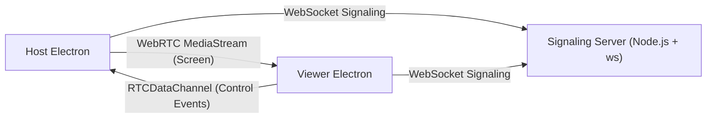

# Remote Desktop WebRTC MVP

一个用于面试作业交付的远程桌面控制系统 MVP。

目标是一天内可演示、可跑通、结构清晰：
- 画面传输走 `WebRTC MediaStream`
- 控制事件走 `WebRTC RTCDataChannel`
- 服务端只做 `WebSocket` 信令转发，不转发视频流

## 1. 项目简介

项目包含两个子应用：
- `server`：Node.js + TypeScript + ws 信令服务
- `client`：Electron + React + TypeScript + Vite 桌面客户端（Host / Viewer 双模式）

Host 负责共享桌面并接收控制事件；Viewer 负责看远程画面并发送鼠标键盘事件。

## 2. 技术栈

- Desktop Client: Electron + React + TypeScript + Vite
- Backend: Node.js + TypeScript + ws
- Real-time streaming: WebRTC MediaStream
- Control events: WebRTC RTCDataChannel
- Monorepo: pnpm workspace

## 3. 架构图



## 4. 核心架构说明

- `WebSocket` 只做信令：`join / peer-joined / offer / answer / ice-candidate / peer-left / error`
- 画面走 `WebRTC MediaStream`，不经过服务端中转
- 控制事件走 `RTCDataChannel`，不通过 WebSocket 发送

为什么服务端不转发视频流：
- 降低服务端带宽和成本
- 减少中转延迟
- 更符合本项目 MVP 范围（可跑通优先）

## 5. 本地启动步骤

在项目根目录执行：

```bash
pnpm install
pnpm dev:server
pnpm dev:client
```

说明：
- 信令服务默认 `ws://localhost:8080`
- `pnpm dev:client` 会启动 Vite、Electron main/preload 编译和 Electron 应用

## 6. 单机测试步骤（功能演示）

1. 启动 `server`：`pnpm dev:server`
2. 启动第一个 `client`：`pnpm dev:client`
3. 第一个窗口选择 `Start as Host`
4. 再启动一个客户端窗口（新终端）：
   - `pnpm --filter client dev:app`
5. 第二个窗口选择 `Start as Viewer`
6. 两端输入相同 `roomId`（默认 `demo-room`）
7. Host 点击 `Start Screen Share`
8. Viewer 确认看到 Host 画面
9. Viewer 先点击 `Enable Remote Control`，再点击视频区域后移动/点击/按键
10. Host 查看 `Control Event Logs` 是否持续收到事件
11. Host 打开 `Allow Remote Control` 后，事件进入真实执行链路
12. Viewer 按 `ESC`（或点 `ESC Stop`）验证紧急停止发送

## 7. 双机真实控制测试步骤

1. Machine A（被控端）运行 Host
2. Machine B（控制端）运行 Viewer
3. 两台机器都指向同一信令服务地址（例如 `ws://<A机器IP>:8080`）
4. 使用相同 `roomId` 入房
5. Host 开始屏幕共享
6. Viewer 点击 `Enable Remote Control` 并在远程画面操作
7. Host 打开 `Allow Remote Control`
8. 在 Machine A 观察真实鼠标/键盘输入是否执行

## 8. 单机双开限制说明（重要）

- 同一台机器同时运行 Host 和 Viewer 时，真实输入会作用于本机，可能出现“自控冲突”。
- 这是远程控制系统的正常现象，不是 WebRTC 链路错误。
- 项目已提供三层保护：
  - Viewer 默认不发送控制事件（必须手动 `Enable Remote Control`）
  - Host 默认不执行真实控制（必须手动 `Allow Remote Control`）
  - Viewer 支持 `ESC` 紧急停止发送

补充：
- 如果 Host 分享的是包含 Viewer 的同一屏幕，会看到“镜中镜”递归画面，这是屏幕采集的正常结果。
- 切换到不包含 Viewer 的屏幕/显示器后该现象会消失。

## 9. 当前 MVP 已实现能力

- Host / Viewer 双模式 Electron 客户端
- 基于 room 的信令管理（同房最多 2 端：host + viewer）
- WebRTC `offer/answer/ice-candidate` 流程
- Host 屏幕采集 + Viewer 远程视频显示
- Viewer 采集 `mousemove / mousedown / mouseup / click / keydown / keyup`
- 控制事件通过 `RTCDataChannel` 传输到 Host
- Host 端 `Allow Remote Control` 开关
- Viewer 端 `Enable Remote Control` 开关 + `ESC` 紧急停止
- Host 端真实输入控制封装（`@nut-tree/nut-js`）+ 自动 mock 降级
- 连接状态显示（`signalingState / iceConnectionState / connectionState`）

## 10. 当前限制

- 当前优先本地网络 / 简单 NAT 场景
- 生产环境需要 TURN 才能覆盖复杂网络
- 默认未实现账号鉴权、审计、权限系统
- 真实输入控制依赖系统权限和本机安全策略
- 单机双开真实控制不适合长期操作，建议双机演示

## 11. 生产级优化方向

- TURN server
- token 鉴权
- 断线重连
- 多显示器选择
- 画质自适应
- 输入事件节流
- 审计日志
- 权限系统

## 12. 真实控制权限说明

Host 真实输入控制依赖系统权限：

- macOS：
  - 需要 `辅助功能 (Accessibility)` 权限
  - 屏幕采集通常还需要 `屏幕录制 (Screen Recording)` 权限
- Host 页面已提供权限引导按钮：
  - `Request Permission`
  - `Open Settings`
  - `Refresh Status`

如果 `nut.js` 初始化或权限检查失败，程序会自动降级到 mock，不会崩溃，并在日志中提示当前处于 mock 模式。
