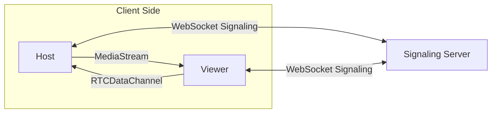
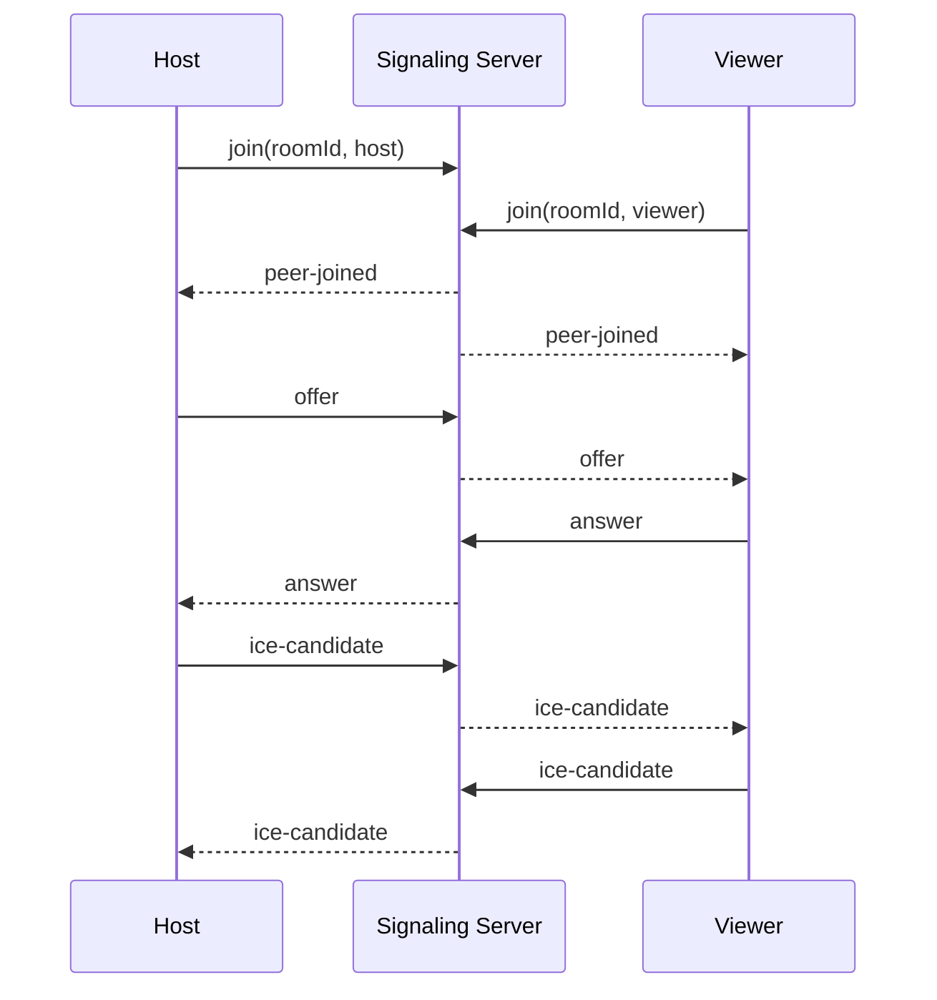
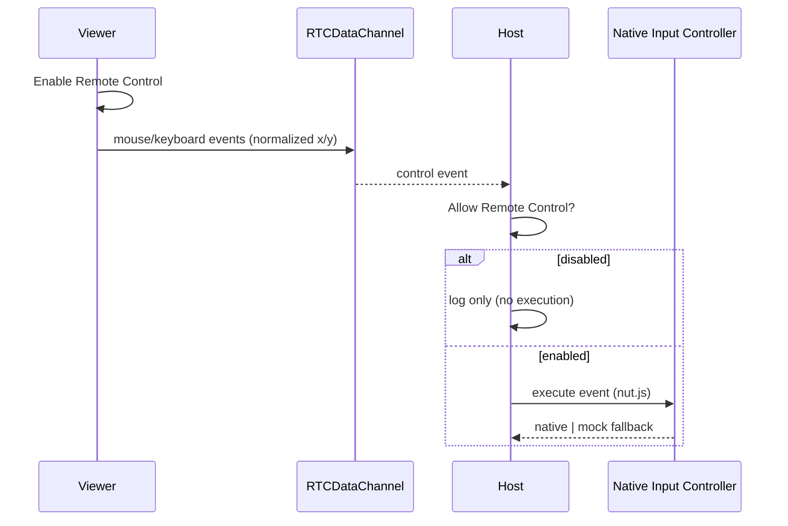

# Architecture

## 1. Design Goals

- Keep media path peer-to-peer for low latency and lower server cost.
- Keep signaling service simple, deterministic, and easy to scale horizontally.
- Keep native input execution isolated behind a strict host-side permission boundary.
- Preserve operability: health checks, structured logs, graceful shutdown.

## 2. Component Boundaries

### Client (Electron)

- `HostPanel`
  - captures desktop media
  - creates RTCPeerConnection and control DataChannel
  - receives control events and conditionally executes native input
- `ViewerPanel`
  - receives remote MediaStream
  - emits normalized control events from remote video region
  - supports explicit enable/disable and emergency stop

### Server (Node.js + ws)

- room management (`host` + `viewer` max per room)
- signaling relay (`offer`, `answer`, `ice-candidate`)
- lifecycle notifications (`peer-joined`, `peer-left`, `error`)
- heartbeat + stale connection cleanup
- health endpoint (`/healthz`)

## 3. Data Planes

Notes:
- Media never passes through signaling server.
- Control events are intentionally separated from signaling traffic.

## 4. Signaling Sequence

## 5. Control Event Flow

## 6. Safety and Permission Boundaries

- Viewer does not send controls until explicitly enabled.
- Viewer supports emergency stop (`ESC`).
- Host does not execute native control until explicitly allowed.
- macOS accessibility permission is checked before execution.
- Native initialization/runtime failures degrade to mock mode without service interruption.

## 7. Scalability Considerations

Current model:
- in-memory room registry (single signaling instance)

Horizontal scaling path:
- external room state store (Redis)
- sticky sessions or WS gateway layer
- TURN deployment for broader network compatibility

## 8. Non-Goals (Current Scope)

- multi-viewer broadcast
- persistent user/session database
- full enterprise authN/authZ
- forensic-grade audit pipeline
